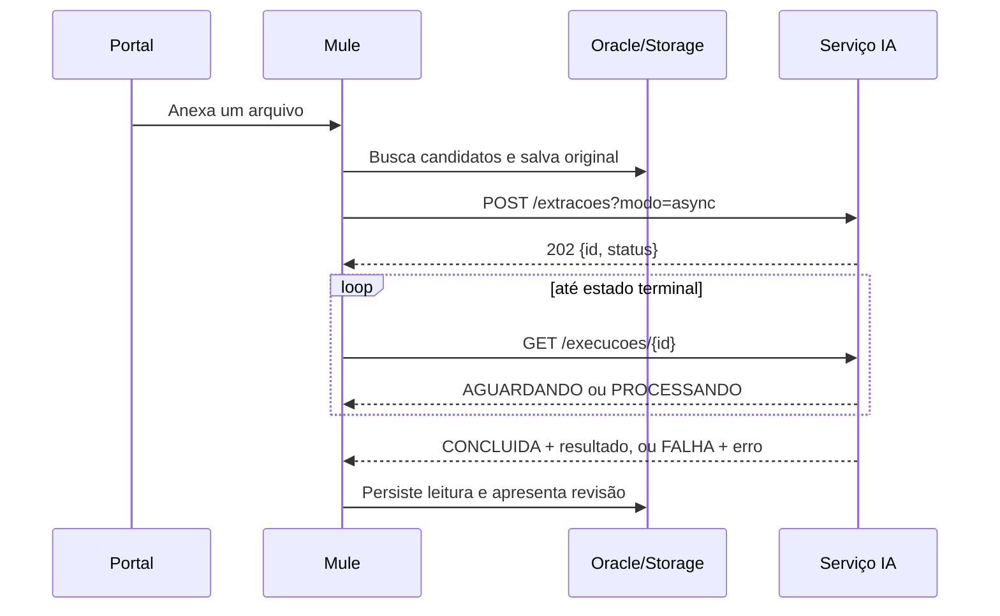

# Contrato HTTP — integração Mule com Pró-Saúde IA

Este documento é o guia de implementação do backend Mule. A especificação vigente é sempre o OpenAPI exposto pelo serviço em `/openapi.json` e visualizado em `/docs`.

## Responsabilidades

O Mule autentica o usuário, consulta o Oracle, guarda o original no storage institucional e persiste o processo. A IA apenas processa um arquivo e devolve leitura estruturada; ela não acessa Oracle, não aprova reembolso e não altera o cadastro.



## 1. Criar execução

`POST {ia.baseUrl}/extracoes?modo=async`

Envie `multipart/form-data`, sempre com **um arquivo por chamada**.

| Campo | Origem no Mule | Obrigatório |
| --- | --- | --- |
| `arquivo` | original enviado pelo servidor | Sim |
| `tipo` | tipo documental escolhido/validado pelo processo | Sim |
| `candidatos` | Oracle; nunca valor livre vindo do browser | Sim |
| `solicitacao_externa_id` | identificador idempotente do arquivo no Pró-Saúde | Recomendado |
| `solicitante_id` | usuário autenticado | Recomendado |

Tipos aceitos: `boleto`, `comprovante_pagamento`, `fatura_tecnica`, `recibo` e `demonstrativo`.

Exemplo de `candidatos`:

```json
[
  {
    "nome": "NOME DO BENEFICIARIO",
    "operadora": "OPERADORA CADASTRADA",
    "valorEsperado": "123.45",
    "competenciaEsperada": "2026-07"
  }
]
```

Resposta esperada, HTTP `202`:

```json
{ "id": "d0c3a5c3-0000-0000-0000-000000000000", "status": "AGUARDANDO" }
```

O Mule grava imediatamente o UUID em `PRSTB045_IA_EXECUCAO`, associado ao registro já criado em `PRSTB034_COMPROVANTE_ARQUIVO`.

## 2. Consultar execução

`GET {ia.baseUrl}/execucoes/{id}`

Estados possíveis: `AGUARDANDO`, `PROCESSANDO`, `CONCLUIDA` e `FALHA`. Faça polling controlado pelo Mule, por exemplo a cada 1,5 segundo, com prazo total e retentativa definidos em configuração.

Resposta resumida quando concluída:

```json
{
  "id": "d0c3a5c3-0000-0000-0000-000000000000",
  "status": "CONCLUIDA",
  "resultado": {
    "documento": { "tipo": "boleto", "campos": {}, "beneficiarios": [], "avisos": [] },
    "pagamento": null,
    "requerRevisao": true
  }
}
```

O Mule deve salvar a leitura original, confiança, origem e evidência. Se o usuário ou analista editar um campo, o valor final vai para `PRSTB038_COMPROVANTE_CAMPO`; a leitura inicial permanece em `PRSTB049_IA_CAMPO_LEITURA`.

## 3. Falhas e pendências

Em `FALHA`, a execução existe e o retorno contém `erro`. Não trate falha como extração vazia. Mostre pendência e permita novo anexo/reprocessamento.

Erros relevantes: `DOCUMENTO_ILEGIVEL`, `TIPO_DOCUMENTO_NAO_IDENTIFICADO`, `TIPO_DOCUMENTO_INCOMPATIVEL` e `DOCUMENTOS_MISTURADOS`.

Uma fatura não é prova de pagamento. Quando boleto/fatura e comprovante forem exigidos, o Mule deve receber cada arquivo separadamente, correlacioná-los pelo comprovante e liberar a análise somente quando houver evidência suficiente.

## 4. Auditoria técnica

`GET {ia.baseUrl}/execucoes/{id}/historico` fornece versões, tentativas e métricas técnicas. O Mule pode registrar os campos necessários em `PRSTB045` a `PRSTB049`; não copie segredos, prompts completos ou resposta bruta ao Oracle. Artefatos grandes ficam em storage de objetos, referenciados por chave e hash.

## 5. Propriedades Mule sugeridas

```properties
ia.baseUrl=http://host-da-ia:8002
ia.timeoutMs=90000
ia.pollIntervalMs=1500
ia.maxPollAttempts=80
ia.integracaoAtiva=true
```

As credenciais de serviço, URL de produção e políticas de rede devem ser definidas pela equipe de infraestrutura e nunca versionadas em propriedades de ambiente.
