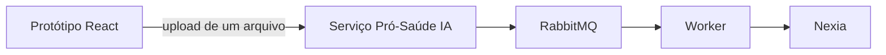

# Integração local do protótipo com a IA

Esta branch demonstra o fluxo do Portal do Servidor com o serviço **Pró-Saúde IA**.
Ela não contém uma cópia da IA, banco SQLite, documentos de teste, filas nem credenciais.
O serviço é obtido e executado separadamente pelo repositório GitLab da IA.

## Componentes



O protótipo usa o proxy `Vite /api/ia` para `http://127.0.0.1:8002`. Em produção, o navegador fala somente com o backend Pró-Saúde; o backend chama a IA e mantém o controle de autenticação, arquivos e dados cadastrais.

## 1. Subir o serviço IA

Clone o repositório de IA e siga o README dele. Para o ambiente local:

```powershell
git clone https://gitlab.detran.df.gov.br/zello/microservico/prosaude/ia.git
Set-Location ia
Copy-Item .env.example .env
docker compose -f compose.rabbitmq.yml up -d --wait
./start.ps1
```

Valide os endpoints:

```powershell
Invoke-RestMethod http://127.0.0.1:8002/health
Invoke-RestMethod http://127.0.0.1:8002/health/llm
```

O Swagger fica em [http://127.0.0.1:8002/docs](http://127.0.0.1:8002/docs). A IA precisa alcançar o Nexia pela VPN.

## 2. Testar diretamente pelo Swagger

No Swagger, abra `POST /extracoes`, clique em **Try it out** e envie **um único arquivo** por chamada.

Preencha:

| Campo | Exemplo |
| --- | --- |
| `arquivo` | um PDF, JPG ou PNG de boleto, comprovante, fatura, recibo ou demonstrativo |
| `tipo` | `boleto` ou `comprovante_pagamento` |
| `modo` | `async` |
| `candidatos` | JSON com os beneficiários já cadastrados |

Exemplo de `candidatos`:

```json
[
  {
    "nome": "NOME DO BENEFICIARIO",
    "operadora": "OPERADORA CADASTRADA",
    "valorEsperado": "123.45",
    "competenciaEsperada": "2026-07"
  }
]
```

A resposta é `202` com `{ "id": "...", "status": "AGUARDANDO" }`. Copie o `id` e consulte `GET /execucoes/{id}` até retornar `CONCLUIDA` ou `FALHA`. `GET /execucoes/{id}/historico` mostra versões, tentativas e tempos para auditoria.

O resultado é uma leitura e evidência para revisão. A IA não aprova pagamento, não altera cadastro e não decide elegibilidade sozinha.

## 3. Subir o protótipo

Em outro terminal, neste repositório:

```powershell
npm install
Copy-Item .env.example .env
npm run dev
```

Abra a URL exibida pelo Vite, entre em **Pagamentos** e envie os documentos. O padrão é assíncrono:

```properties
VITE_IA_EXECUTION_MODE=async
```

O front envia um arquivo por vez, com os candidatos e valores esperados definidos no cenário de teste. Ele consulta o estado da execução até receber o resultado e salva a simulação local pela própria API de IA.

## 4. Contrato para o sistema real

No sistema real o navegador não deve enviar candidatos livres para a IA. O backend deve:

1. autenticar o servidor;
2. buscar no Oracle os beneficiários, planos, operadora, competência e valores esperados;
3. guardar o original em storage controlado;
4. chamar `POST /extracoes?modo=async`, um arquivo por vez;
5. persistir o identificador da execução e consultar seu status;
6. preservar a leitura da IA, a evidência e as alterações manuais para o analista.

As tabelas de negócio atuais do módulo de pagamentos continuam sendo a fonte oficial. A persistência de rastreabilidade da IA deve ser revisada pelo DBA antes de qualquer DDL em Oracle. Não use o SQLite de desenvolvimento como modelo de nomes ou estrutura do Oracle.

## O que é versionado nesta branch

- telas e contrato do portal para upload, consulta assíncrona, revisão e visão do analista;
- proxy local para o serviço IA;
- tipos, validações e exibição de evidências, avisos e preenchimento manual;
- este guia.

Não são versionados `.env`, documentos reais, respostas de modelo, SQLite, logs, credenciais, cache de Python nem a pasta local `services/ia`.
